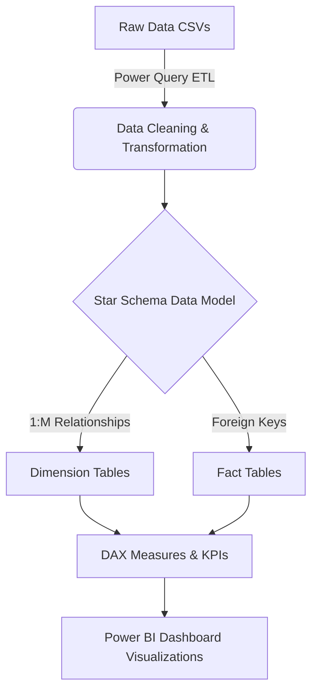

<div align ="center">

</div>

# Samsung Supply Chain & Logistics Dashboard 🚚

<!-- Badges Section -->
<div align="center">
  
  
  
  
  
  
</div>  

---

Welcome to the **Samsung Supply Chain & Logistics Dashboard** repository. This project provides a comprehensive end-to-end overview of supply chain operations, tracking everything from supplier procurement to final customer delivery.

## 💼 Business Case

**The Challenge:**
Global supply chains suffer from fragmented data silos. Procurement, inventory, logistics, and sales departments often operate independently, leading to unpredictable lead times, severe carrier delays, and suboptimal inventory management.

**The Solution:**
This project consolidates disparate CSV datasets into a centralized, interactive Power BI dashboard. By utilizing a Star Schema data model and advanced DAX measures, stakeholders can monitor the complete lifecycle of a product—from raw material acquisition to the final customer delivery—enabling data-driven decisions to optimize carrier performance and minimize stockouts.

---

## 📸 Dashboard Overview

### Static Preview
<figure align="center">
  
  <figcaption><i>
  Primary Subjects: Six KPI cards labeled Gross Revenue 186.86M, Total Revenue 176.95M, Total Profit 48.56M, Profit Margin 27.44%, Perfect Order 75%, and Total Shipment 8K. Additional visuals include a supplier inventory and shipment flow diagram with supplier and customer icons, a bar chart for average lead time by supplier, a column chart for inventory value by product, a bar chart for total delay by carrier, and a stacked bar for total revenue by platform.
  </i></figcaption>
</figure>

The file can be viewed here [Dashboard](Samsung_Dash.pbix)
---

## 🏗️ Architecture Diagram

The data pipeline and modeling architecture follow a standard Extract, Transform, Load (ETL) and reporting workflow:



---

## 📊 Key Performance Indicators (KPIs) Explained

The dashboard tracks the following high-level financial and operational metrics, which serve as the pulse of the supply chain:

*   💰 **Gross Revenue ($186.86M):** The total monetary value generated by sales before any deductions like discounts, returns, or taxes are applied.
*   💵 **Total Revenue ($176.95M):** The net revenue realized after accounting for discounts, returns, and allowances.
*   📈 **Total Profit ($48.56M):** The bottom-line profit calculated by subtracting the cost of goods sold (COGS) and logistical expenses from the Total Revenue.
*   📊 **Profit Margin (27.44%):** The percentage of revenue that remains as profit, indicating the overall efficiency of pricing and cost control.
*   🎯 **Perfect Order % (75%):** A crucial supply chain metric indicating that 75% of all orders are delivered to the right place, at the right time, in perfect condition, with the correct documentation.
*   📦 **Total Shipment (8K):** The total count of distinct shipment batches processed through the logistics network.

---

## 🔄 Supply Chain Stages & Insights (Q&A)

Based on the dashboard visualizations, here are answers to key business questions:

*   **Q: Which retail platform is driving the most revenue for Samsung?**
    *   **A:** Amazon leads the platforms with $37M in total revenue, closely followed by Flipkart and Best Buy at $36M each.
*   **Q: How is the logistics network performing in terms of carrier delays?**
    *   **A:** Maersk is experiencing the highest number of delays with a count of 87, which is significantly higher than DHL (66) and DB Schenker (65).
*   **Q: What is the standard average lead time for top-tier suppliers?**
    *   **A:** The average lead time for top suppliers including BOE Tech, Samsung, Sony, Taiwan S, and SK Hynix is 12 days. 

---

## 🗄️ Repository Structure

```text
📁 Samsung-Supply-Chain-Dashboard
├── 📄 README.md
├── 📄 Samsung_Dash.pbix                  # Main Power BI Report File
├── 🖼️ Screenshot 2026-07-24 103431.jpg
└── 📁 data                               # Raw CSV Datasets
    ├── 📄 dim_customer.csv
    ├── 📄 dim_date.csv
    ├── 📄 dim_facility.csv
    ├── 📄 dim_product.csv
    ├── 📄 dim_supplier.csv
    ├── 📄 fact_inventory.csv
    ├── 📄 fact_procurement.csv
    ├── 📄 fact_production.csv
    ├── 📄 fact_sales.csv
    └── 📄 fact_shipment.csv
```

---

## 🔭 Future Scope

This project lays a strong foundation, but there is always room for enhancement. Future iterations may include:

*   **Real-Time Data Integration:** Transitioning from static CSVs to a SQL Server database utilizing DirectQuery for near real-time logistics tracking.
*   **Predictive Analytics:** Integrating a Python/Machine Learning model to forecast inventory stockouts based on historical lead times and seasonal demand spikes.
*   **Row-Level Security (RLS):** Implementing RLS so regional supply chain managers only see data pertaining to their specific territories or facilities.
*   **Drill-Through Pages:** Adding granular drill-through reports to investigate specific delayed shipments down to the individual order ID level.

---

## 🛠️ Tools & Technologies Used
*   **Microsoft Power BI:** Data Modeling, DAX, and Visualizations.
*   **CSV / Excel:** Raw data storage and ingestion.
*   **powerbistudio.com:** Used for one-click JSON theme generation and color styling.

---

## 🚀 How to Run Locally
1. Download all the `.csv` datasets from the `/data` folder to a local directory.
2. Open the `Samsung_Dash.pbix` Power BI file.
3. Navigate to **Transform Data** -> **Data Source Settings** and Change Source to point to your local directory.
4. Click **Close & Apply**, then **Refresh** to load the data.

---

## 🏁 Conclusion

The **Samsung Supply Chain & Logistics Dashboard** serves as a powerful testament to the value of data integration and visualization in modern supply chain management. By transforming raw, siloed CSV datasets into an interactive and cohesive Star Schema model, this project successfully bridges the gap between procurement, inventory, logistics, and sales. 

Through this dashboard, stakeholders can immediately see the broader financial picture such as generating **$48.56M in Total Profit** at a healthy **27.44% margin** while simultaneously drilling down into operational realities. It highlights critical bottlenecks, like the **87 carrier delays** experienced with Maersk, and tracks the **12-day average lead time** across top-tier suppliers. More importantly, it empowers decision-makers to safeguard the **160K inventory value** and push the current **75% Perfect Order rate** even higher across all 8K total shipments.

---

# 🤝 Connect With Me

## 👨‍💻 Author

**Rajay Jain**

* **📧 Email**: jainrajay2001@gmail.com  
* **💼 LinkedIn**: [www.linkedin.com/in/rajay-ajay-jain-a3abb4168](https://www.linkedin.com/in/rajay-ajay-jain-a3abb4168)  
* **🐙 GitHub**: [https://github.com/RajayJain](https://github.com/RajayJain)  

---

## ⭐ Support

If you find this analysis framework resourceful or helpful for your retail applications, please consider giving this project repository a ⭐ on GitHub!


---